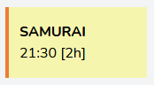
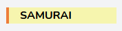
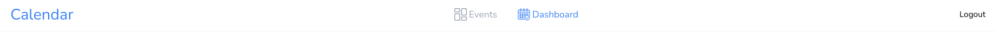
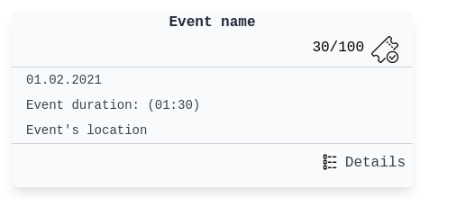

# Event planner website

List of content

- [Description](#Description)
- [Components](#Components)

# Description
todo description

# Components
Section in which there are documented components along with example usage
## event-short-tab
There are 2 versions of this component:

<x-event-short-tab.big ... :



<x-event-short-tab.small ... :



### Parameters
- event: (**mandatory**) Event model variable
- color: (**default 0**) Used to change color palette, available palettes below
- class: (**optional**) Any css classes

### Available color palettes
- 0
### Adding new colors
In file [tailwind.config.js](tailwind.config.js) in "colors" field you can add new
palettes, according to schema:

    shortTab{ID}: {
        primary: '#RGB',
        secondary: '#RGB'
    },
Then run **npm run dev**
### Example usage
Gives tabs captured on above screens
```html
<x-event-short-tab.big :event="$event" class="w-40 my-5"></x-event-short-tab.big>
<x-event-short-tab.small :event="$event" class="w-40 my-5"></x-event-short-tab.small>
```

## Navbar 
Has two components
<x-navbar.bar> which contains <x-navbar.link> ... :


### Parameters to bar
- destinations: (**default events.index**) List of routes
- names: (**default suprise**) List of destination names 
- icons: (**default view-list**) List of icons from resources/views/components/icons, icons = svg images
- slot: (**optional**) Navbar name

Values in list are separated by ' ' - one space 

Amount of links in bar depends on count of destinations paramenter eg. if destination='aa bb', then bar has two links.

Value at first position(before first space) corresponds to first value in other parameters...  

### Parameters to link
- destination: (**mandatory**) Route
- icon: (**mandatory**) Icon from resources/views/components/icons
- class: (**optional**) Any css class
- slot: (**mandatory**) link name 

Link on hover changes color from gray to light blue and when user is on linked page it changes color to solid blue.

### Example usage
Bar
```html
    <x-navbar.bar destinations="events.index dashboard" names="Events Dashboard" icons="dashboard calendar">
        {{ __('Calendar') }}
    </x-navbar.bar>
```
Link
```html
    <x-navbar.link destination="events.create"
                   icon="calendar"
                   class="flex items-center px-1 sm:px-2 md:px-3 md:px-4 lg:px-5 text-sm md:text-base lg:text-md xl:text-lg">
        {{ __( 'Create Event' ) }}
    </x-navbar.link>
```

## event-tab
<x-event-tab.side...



### Parameter
- event: (**mandatory**) Event model variable


This element is to be found next to the calendar component and its purpose is to give user more detailed info about given event.

One can find there event's name, time, duration, place and what is perhaps the most important, number of still avaiable tickets.

This element also has an href which directs to the given event detailed view.

### Example usage
```html
<x-event-tab.side :event="$event"></x-event-tab.side>
```
